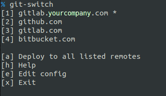

**git-switch**

---

Horrible little script that easily switches between git remote urls and different user accounts.

*and force overwrites your commit history- this is generally a very bad thing.  Make sure you know what you're doing*

---

**Description**

Do you maintian multiple copies of your code in different directories so that you can sync to different remote git urls?  Do you use different user names for these accounts?  (github.com, gitlab.com, git.yourcompany.com, etc)

`git-switch` will allow you to easily switch between pre-configured upstream providers and/or user names from within a single directory.



- If the current directory is not under git control, `git-switch` will prompt you to choose a provider and then initialize the directory for you.
- Updates the final line of the README with a "Last Updated: $date" line to allow for immediate add,comment & push to the new remote url.  If there's no README.md, it will create it and add the datestamp.
- The "Edit" option will open up the config file ($HOME/.git-switch) in your predefined $EDITOR

**Usage**

-Create a file called ".git-switch" in your home directory containing the user names and urls of the providers you want to switch between with the following format:

```
<username>:<gitlab.com>
<username>:<github.com>
<username>:<git.mycompany.com>
```

-Move the git-switch script somewhere in your path so that its easily accessible

```
cp git-switch /usr/local/bin
```

-Change the permissions on git-switch so that its executable

```
chmod +x /usr/local/bin/git-switch
```

-Run the script from within an existing git controlled directory (if you run it from an uninitialized directory, you will get prompted to initialize it and choose the remote provider)

**Note**

`In order to preserve history between providers, you may find it useful to force the first update after switching, otherwise you may end up with a whole slew of merge conflicts!` 
*and by "preserve" I mean "Overwrite"  Eww.  Ugh. Yes, very bad.  Be sure you understand what this does before using it!


`i.e. "git push -f"`

``Use with caution!``

---

Last Updated: Tue Mar 28 15:16:40 CDT 2017
